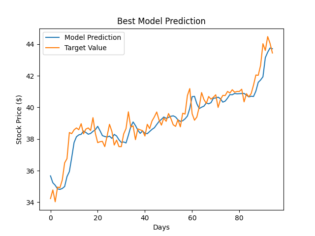
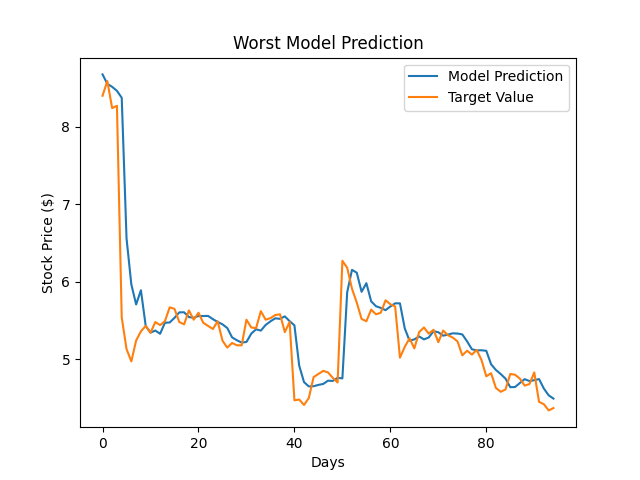
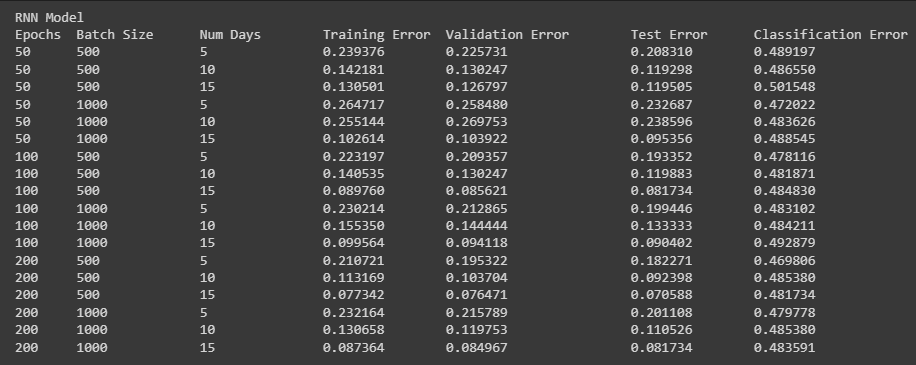

# Welcome to Stocks RNN

## Introduction

The purpose of this project is to create a recurrent neural network model to predict future stock market prices according to previous price ranges. The number of days the model is trained with will be treated as a hyperparameter, with the values tested for the hyperparameter ranging from 5 to 15. This model will be tested for accuracy based on its ability to predict stock values of the next day.In addition to this, the model will be tested on whether it correctly predicts a positive or negative change in stock price and how close it is to the total amount of increase or decrease in the stock price.

This recurrent neural network will be trained to both predict whether a stock price will increase or decrease, and separately predict by how much the stock will increase or decrease. As a result, this recurrent neural network will utilize both standard classification (increase or decrease) and standard regression. 

This project will utilize a simple Recurrent Neural Network Model as well as a Long Short Term Memory Model for the prediction of the stock market. Since stock prices often have various trends it is essential to see the previous data to aid in one's prediction on the future data. Hence RNN and LSTM are very suitable for this project as they can store previous trends and make a highly accurate predictions.

## Model

### Figure

### Parameters

Since each input contains 4 values, opening price, highest price, lowest price, and closing price each day will consist of 4 values.

For the RNN stocks model there is one rnn layer with 4 (number of values in input) x 150 (Chosen Hyperparameter) parameters with 150 biases and one fully connected layer of size 150x1 with 1 bias. Hence there are 4x150 + 150 + 150x1 + 1 = 600 + 150 + 150 + 1 = 901 total parameters.

For the LSTM stocks model there is one lstm layer with 4 (Since there are 4 channels in LSTM) x 4 (number of values in input) x 150 (Chosen Hyperparameter) parameters with 150 biases and one fully connected layer of size 150 (number of previous inputs) x 1 with 1 bias. Hence there are 4x4x150 + 150 + 150x1 + 1 = 2400 + 150 + 150 + 1 = 2701 total parameters.

### Examples

Best Model Prediction with a mean squared error of approximately 0.12.

Worst Model Prediction of Mean Squared Error of approximately 0.65.

## Data

### Source

https://www.kaggle.com/datasets/borismarjanovic/price-volume-data-for-all-us-stocks-etfs

The dataset that will be utilized to train this model will be, "Huge Stock Market Dataset" by Boris Marjanovic under the CC0: Public Domain License. This dataset contains all US-based stocks and ETFs.

### Summary

For this project, we will only be using Stocks (not ETFs). This dataset contains 7195 different stock companies and their own stock price ranges per day in their own file.

Given a specific date and company, this dataset contains information on the open price of the day, the highest price of the day, the lowest price of the day, the closing price of the day, volume and OpenInt of that company's stocks for that date.

### Transformation

Of the 7195 different stock companies, there are 580 companies that contain less than 100 days of data. Hence they will be removed from the used dataset. As a result, there will be a total of 6615 companies, from each we will take the 100 most recent available days and utilize them as our dataset for this project.

The volume and OpenInt will be ignored for this dataset as they are irrelevant for the purpose of predicting future price changes.

### Data Split

The data was first randomized, then split such that 60% of the data was assigned as training data, 20% was assigned as validation data, and 20% was assigned as test data. This split was chosen arbitrarily, however the randomization was important to ensure each data section had both recent and old data points. If the data points were split based on time, trends found in recent or older stocks may not be recognized by the model depending on the time split. Similarly, if the data points were split based on company the model may not recognize techniques or patterns that another company used. As such, the data was simply split randomly rather than based on a particular attribute. It is important to note that different companies were in different dataset as we wanted this model to learn the general pattern for which it could expand and be tested for completely new companies.

## Training

### Training Curve

### Advanced Concept: Data Augmentation

The data was augmented by reversing each input to predict the previous days. In other words utilizing the data from days 5 to 2 to predict the prices from the 1st day. Since the purpose of the model is to predict the pattern of the prices, calculating the pattern in reverse can also expand the amount of input and give more data for the model to train.

### Hyperparameter Tuning

The following table shows the training, test, and validation accuracies for different hyperparameter values. Note: for Training Error, Validation Error, and Test Error it is better to have a lower value since the value represent its average distance from the target values. For Classification Error it is better to have a larger value as it predicts the accuracy of whether the model's prediction of increase or decrease was accurate.

RNN Model

LSTM Model

As can be seen from the table, the RNN model performed slightly better than the LSTM Model. With the observations from the above table the best hyperparameter choices were to choose 100 Epochs with a batch size of 500 and with the previous 15 days of data.

## Results

### Quantitative Measures

The quantitative measures that were used to evaluate this model is by calculating the mean squared error of the model and by calcuating if it's prediction of increase or decrease were accurate. The mean squared error test how far the model's prediction were from the actual target company. The results obtained from the chart above indicated that our best model was on average 9% away from the target value. We also measured our regression model to predict an increase or decrease of the stock prices. Although we noticed that our regression model was not best suited to predict only the increase or decrease since our model is aimed to get close to the target value and not focused on whether the final value is increasing or decreasing. In order to achieve a successful increase or decrease model we should replicate the previous model with a soft max for it's final layer and train the model accordingly.

### Quantitative and Qualitative Results

### Justification of Results

Both models were designed as regression based models for predicting, and as such they both were able to predict the target with relatively high accuracy. The _____ model performed _____ better than the _____ model. This is likely due to ______. Overall both models were able to predict with relatively high accuracy, however, these models were designed with regression in mind and classification was a secondary focus. To perform the increase or decrease classification the model's predictions were simply compared to the previous day to determine whether the model implied an increase or decrease. This turned out to be very unsatisfactory, as the model's classification predictions were much worse in comparison to the regression based results.

## Ethical Considerations

This model's limitations must be considered fully to be used ethically. The most prominent limitation is the model's accuracy; this model is relatively accurate but may still produce predictions that could be slightly or very off. The model also does not indicate or predict this inaccuracy, and as such the model's accuracy must be kept in consideration when in use. Informing others of the model's predictions without mentioning the model's accuracy may be a source of unethical use. Using this model to suggest others should buy or sell a stock based on the prediction without mentioning the possibility of error is an example of this unethical use.

The model's training should also be kept in consideration in order to be used ethically. This model was trained on data collected up to 11/10/2017. As such, usage to predict dates beyond 2017 should keep this limitation in mind. Stock market trends and strategies may have changed between the time of data collection and training and the use of this model. As such the model's accuracy and use should decrease the further the usage time is from 11/10/2017. Failing to do so or consider this could be a source of unethical use. Using this model's prediction in 2030 to advise others on a course of action without indicating this flaw is an example of this unethical use.

Lastly, in addition to considering the time of the model's training data, biases within the training data itself should be considered. Companies with less than 100 data points were removed from the model's training data. The reason for the fewer data points was not considered in this data restriction. As such, any companies with trends that led to early bankruptcy will not have been detected by this model. This means this model should not be used to predict stock values of any smaller companies, as it will likely not detect whether the company may suddenly lose stock value or go bankrupt. Failing to consider this when using this model to inform others may be another source of unethical use.

In summary, the model's many considerations and biases must be considered before using this model to inform one's own or other's decisions. Failing to do so may result in unethical use.

## Authors

Most of the work for this project will be done collaboratively utilizing VSC's (visual studio code's) extension of live share which allows multiple users to collaborate and work on the same file at the same time. In addition to this, there will be open verbal communication via a voice call on Discord throughout this project. Training and testing models may be done utilizing Google Collab to make use of their GPUs. Weekly progress meetings will be conducted on Friday 3-4pm and Sunday 3-4pm.

### Division of Work

Importing and Preprocessing Data: Kesavar and Ryan

Base Recurrent Neural Network Model: Kesavar, Ryan and Carmelo

LSTM Recurrent Neural Network Model: Kesavar and Ryan

Training Function: Kesavar and Carmelo and Ryan

Overfit to Single Point: Kesavar and Carmelo

Testing RNNs and Displaying Results: Kesavar, Ryan and Carmelo
