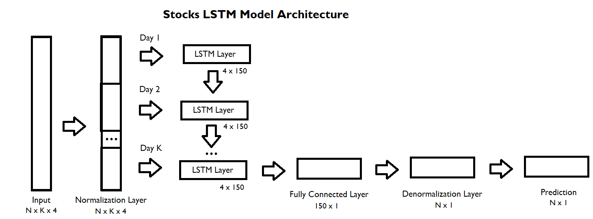
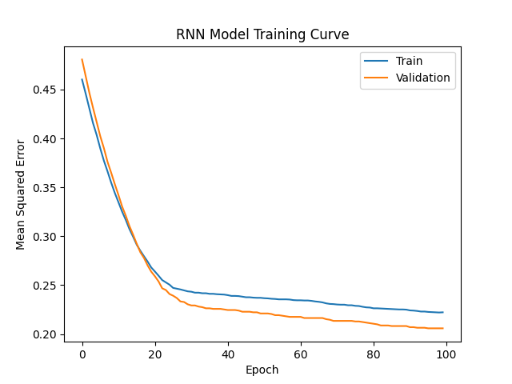
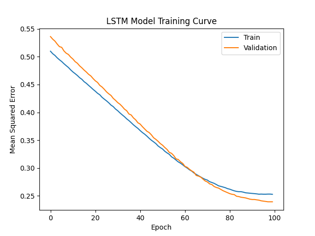
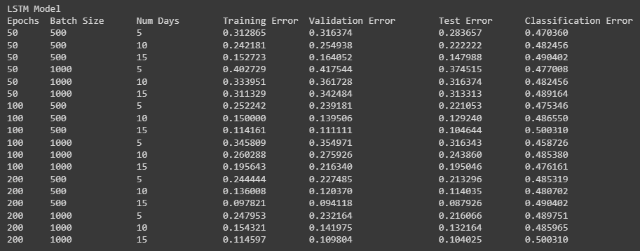

# Welcome to Stocks RNN

## Introduction

The purpose of this project is to create a recurrent neural network model to predict future stock market prices according to previous price ranges. The model will receive information for a number of days, which will be treated as a hyperparameter, and output a prediction of the stock value for the next day. This model will be tested for accuracy based on its ability to predict stock values for the next day. In addition to this, the model will be tested on whether it correctly predicts a positive or negative change in stock price.

This recurrent neural network utilizes standard classification to predict an increase or decrease, and standard regression to predict the stock value for the next day.

This project utilizes a Recurrent Neural Network (RNN) Model as well as a Long Short Term Memory (LSTM) Model for the prediction of the stock market. Since stock prices often have various trends it is essential to see the previous data to aid in one's prediction of future data. Hence RNN and LSTM are very suitable for this project as they can store previous trends and make highly accurate predictions.

## Model

### Figure

### Parameters

Each day contains 4 features: the stock's opening price, the stock's highest and lowest prices for that day, and the stock's closing price. As such, each input will consist of these 4 features.

For the RNN stocks model, there is one RNN layer with 4 (number of features in input) x 150 (chosen hyperparameter) parameters along with 150 biases and one fully connected layer of size 150 (number of inputs in the previous layer) x 1 along with 1 bias. Hence there are 4x150 + 150 + 150x1 + 1 = 600 + 150 + 150 + 1 = 901 total parameters.

For the LSTM stocks model there is one LSTM layer with 4 (Since there are 4 channels in LSTM) x 4 (number of values in input) x 150 (chosen hyperparameter) parameters with 150 biases and one fully connected layer of size 150 (number of inputs in the previous layer) x 1 with 1 bias. Hence there are 4x4x150 + 150 + 150x1 + 1 = 2400 + 150 + 150 + 1 = 2701 total parameters.

### Examples

Best Model Prediction with a mean squared error of approximately 0.12.

Worst Model Prediction of Mean Squared Error of approximately 0.65.

## Data

### Source

https://www.kaggle.com/datasets/borismarjanovic/price-volume-data-for-all-us-stocks-etfs

The dataset utilized to train this model is the "Huge Stock Market Dataset" by Boris Marjanovic under the CC0: Public Domain License. This dataset contains all US-based stocks and ETFs.

### Summary

This project only used stocks (not ETFs). This dataset contains 7195 different stock companies and their own stock price ranges per day in their own file.

Given a specific date and company, this dataset contains information on the open price of the day, the highest price of the day, the lowest price of the day, the closing price of the day, volume and OpenInt of that company's stocks for that date.

### Transformation

Of the 7195 different stock companies, there are 580 companies that contain less than 100 days of data. Hence they are removed from the used dataset. As a result, there are a total of 6615 companies, with 100 most recent available days for each being used as the dataset for this project.

The volume and OpenInt will be ignored for this dataset as they are irrelevant for the purpose of predicting future price changes.

### Data Split

The data was first randomized, then split such that 60% of the data was assigned as training data, 20% was assigned as validation data, and 20% was assigned as test data. This split was chosen arbitrarily, however, the randomization was important to ensure each data section had both recent and old data points. If the data points were split based on time, trends found in recent or older stocks may not be recognized by the model depending on the time split.

Similarly, if the data points were split based on the company the model may not recognize techniques or patterns that another company used. As such, the data was simply split randomly rather than based on a particular attribute. It is important to note that different companies were in different datasets as we wanted this model to learn the general pattern for which it could expand and be tested for completely new companies.

## Training

### Training Curve

### Advanced Concept: Data Augmentation

The data was augmented by reversing each input to predict the previous days. In other words, utilizing the data from days 5 to 2 to predict the price of the 1st day. Since the purpose of the model is to predict the pattern of the prices, calculating the pattern in reverse can also expand the amount of input and give more data for the model to train.

### Hyperparameter Tuning

The following table shows the training, test, and validation accuracies for different hyperparameter values. Note that for Training Error, Validation Error, and Test Error it is better to have a lower value since the value represents its average distance from the target values. For Classification Error it is better to have a larger value as it predicts the accuracy of whether the model's prediction of increase or decrease was accurate.

RNN Model

LSTM Model

As can be seen from the table, the RNN model performed slightly better than the LSTM Model. With the observations from the above table the best hyperparameter choices were to choose 200 epochs with a batch size of 500 and with the previous 15 days of data.

## Results

### Quantitative Measures

The quantitative measures that were used to evaluate this model were the mean squared error of the model compared to the target stock value, and the correctness of the model's prediction of an increase or decrease. The mean squared error tested how far the model's prediction was from the actual target stock value. The correctness of the model's prediction of an increase or decrease was based on whether the model predicted a higher or lower stock value than the previous day's stock value, and was compared to whether the actual stock value had increased or decreased. A correct prediction was a correct increase or decrease prediction, and anything else was considered incorrect.

### Quantitative and Qualitative Results

The results obtained from the chart above indicated that our best model was on average 0.070588 away from the target value. This model was the RNN model and had 200 epochs, a batch size of 500, and had been given the previous 15 days of data. It had a mean squared training error of 0.077342, a mean squared validation error of 0.076471 and a mean squared testing error of 0.070588. It also had a classification (increase/decrease) error of 48.1734% due to this model being solely trained to evaluate a value that is closest to the next prediction rather than value being larger or smaller (explained in more detail below).

Below are 9 sample companies and how both model were able to predict its values. As one can see from these examples that the model often understands the general patterns of the stock values but is not very accurate on random increase or random decrease spikes. But overall the model is relatively accurate on its predictions.

# Justification of Results

Evaluating a machine learning model that predicts stock prices is a very challenging task due to the nature of stock prices. Most of the reasons for any drastic changes in stock values have to do with facts that are outside of the knowledge of previous stock prices. For example, a change in CEO, a new invention by a specific company, a devastating war, a pandemic, or others could drastically influence a company's stock values. None of these examples were accounted for in these models to learn rather the model was only trained by previous stocks values. Given these limitations, these models would be very effective in calculating short-term stock values and would become very close to the actual result.

During the testing phase, we ensured that companies that were tested on were never seen before by the model. This allowed the model to be tested on its predictions for entirely new companies. Thus these models could be utilized in a completely new company and will still perform very accurately with a very low error. In addition, the training set and validation set both had unique companies to ensure the ability of this model to later be expanded onto entirely new companies.

The RNN and LSTM models were designed as regression-based models for predicting the next day's stock values, and as such they both were able to predict the target price with relatively low error. The RNN model performed better than the LSTM model given any selection of hyperparameters. This is likely due to having a small previous set of days for the model to learn from. Given a larger number of days to learn from the LSTM model may improve in accuracy over the RNN model due to being able to prioritize important information.

Further improvement to either model could be made by testing additional hyperparameter values, modifying the model architecture to include additional layers, or simply providing additional training data which includes more recent stock results to generalize to more recent stock trends. Overall, both models learned to predict a day's stock value with relatively low error. However, these models were designed with regression in mind and classification was a secondary focus.

We also measured our regression model to predict an increase or decrease in stock prices. This turned out to be highly inadequate, as the model's classification predictions were much worse in comparison to the regression-based results. The best out of both models only slightly outperforms a model that simply outputs an 'increase' in every case. In order to design a model to successfully predict an increase or decrease in stock values we could replicate the previous model with a softmax for its final layer and adjust the data sets for the model accordingly.

The results obtained from our model were very reasonable and impressive. This model was very accurate with its predicted values and as seen by the example graphs above the model performed very well even in the worst mean squared error example. It was still able to find the general pattern and keep predicting the correct values. Although as seen by the results in the tables displayed in Hyperparameter tuning, the hyperparameters were essential in choosing the most accurate model as some other hyperparameter choices performed very poorly.

## Ethical Considerations

This model's limitations must be considered fully to be used ethically. The most prominent limitation is the model's accuracy; this model is relatively accurate but may still produce predictions that could be slightly or very off. The model also does not indicate or predict this inaccuracy, and as such the model's accuracy must be kept in consideration when in use. Informing others of the model's predictions without mentioning the model's accuracy may be a source of unethical use. Using this model to suggest others should buy or sell a stock based on the prediction without mentioning the possibility of error is an example of this unethical use.

The model's training should also be kept in consideration in order to be used ethically. This model was trained on data collected up to 11/10/2017. As such, usage to predict dates beyond 2017 should keep this limitation in mind. Stock market trends and strategies may have changed between the time of data collection and training and the use of this model. As such the model's accuracy and use should decrease the further the usage time is from 11/10/2017. Failing to do so or considering this could be a source of unethical use. Using this model's prediction in 2030 to advise others on a course of action without indicating this flaw is an example of this unethical use.

Lastly, in addition to considering the time of the model's training data, biases within the training data itself should be considered. Companies with less than 100 data points were removed from the model's training data. The reason for the fewer data points was not considered in this data restriction. As such, any companies with trends that led to early bankruptcy will not have been detected by this model. This means this model should not be used to predict the stock values of any smaller companies, as it will likely not detect whether the company may suddenly lose stock value or go bankrupt. Failing to consider this when using this model to inform others may be another source of unethical use.

In summary, the model's many considerations and biases must be considered before using this model to inform one's own or others' decisions. Failing to do so may result in unethical use.

## Authors

Most of the work for this project was done collaboratively utilizing Visual Studio Code's extension live share which allows multiple users to collaborate and work on the same file at the same time.  Training and testing models were done utilizing Google Collab to make use of their GPUs.

### Division of Work

Importing and Preprocessing Data: Kesavar and Ryan

Base Recurrent Neural Network Model: Kesavar, Ryan and Carmelo

LSTM Recurrent Neural Network Model: Kesavar and Ryan

Training Function: Kesavar and Carmelo and Ryan

Testing RNNs and Displaying Results: Kesavar, Ryan and Carmelo

Readme.md: Kesavar, Ryan, and Carmelo
